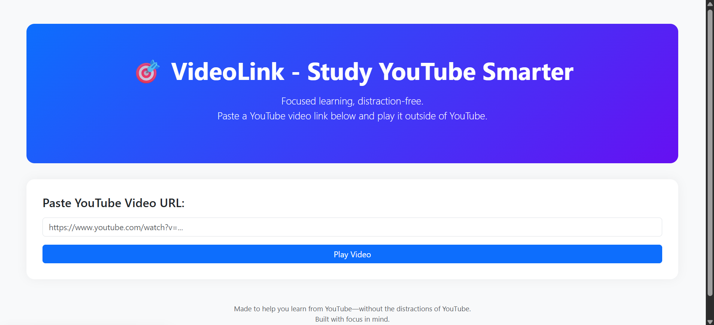

# 🎬 VideoLink

**VideoLink** is a minimal web platform designed to help users watch YouTube videos **without opening YouTube itself** — perfect for staying focused and avoiding distractions.

## 🌟 Features

- 🔗 Accepts any valid YouTube video URL  
- 🚫 Bypasses homepage, comments, and recommendations  
- 🧠 Ideal for studying and staying productive  
- 📱 Responsive and clean user interface using Bootstrap  

## 🚀 How It Works

1. Paste a YouTube video URL on the homepage.  
2. The app extracts the video ID and embeds it in a distraction-free viewer.  
3. Enjoy the content without getting pulled into the YouTube rabbit hole.  

## 📸 Preview


  

## 🛠️ Tech Stack

HTML5, CSS3, Bootstrap 5, Node.js, Express, EJS  

## 📁 Folder Structure

```
VideoLink/
├── public/
│   ├── playStyle.css
│   └── mainStyle.css
├── views/
│   ├── index.ejs
│   └── play.ejs
├── app.js
├── package.json
└── README.md
```

## 📦 Installation

```bash
git clone https://github.com/yourusername/VideoLink.git
cd VideoLink
npm install
node app.js
```

Visit `http://localhost:8080` in your browser to use the app.

## 🧠 Motivation

> Built to solve a real challenge — making YouTube accessible without the usual distractions, especially helpful for focused learners.
